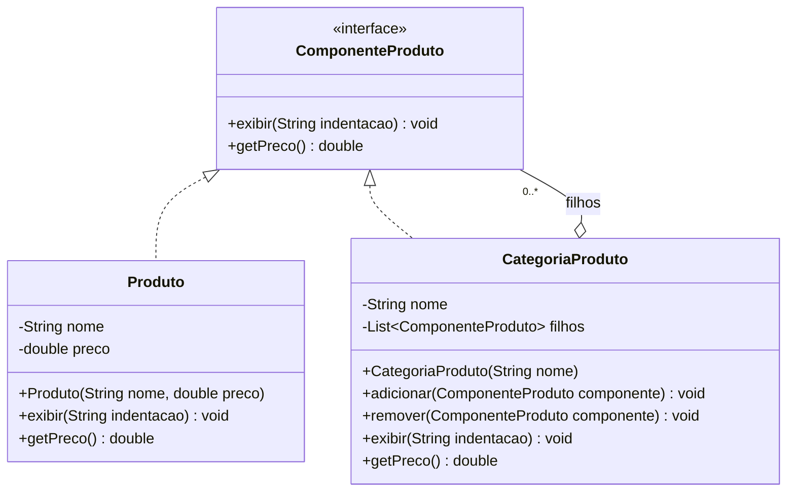

# Composite Pattern - UML

## Diagrama de classes

## Compatibilidade com o padrão

| Elemento | Papel |
|----------|-------|
| `ComponenteProduto` | Component |
| `Produto` | Leaf |
| `CategoriaProduto` | Composite |
| `filhos` | Lista que permite compor produtos e categorias |

## Por que é um pattern?

- `Produto` e `CategoriaProduto` compartilham a mesma interface.
- O cliente pode tratar produtos e categorias como `ComponenteProduto`.
- `CategoriaProduto` pode conter outros `ComponenteProduto`, permitindo hierarquias recursivas.
- `getPreco()` soma os valores dos filhos, propagando o cálculo pela árvore.
- O diagrama é compatível com o código em `Composite/Pattern`.
