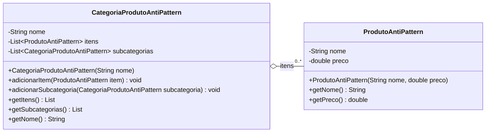

# Composite AntiPattern - UML

## Diagrama de classes

## Compatibilidade com o anti-pattern

| Elemento | Papel |
|----------|-------|
| `CategoriaProdutoAntiPattern` | Classe que gerencia produtos e subcategorias separadamente |
| `ProdutoAntiPattern` | Classe de produto simples |
| `itens` | Lista exclusiva para produtos |
| `subcategorias` | Lista recursiva de outras categorias |

## Problemas

- Não existe interface comum entre produto e categoria.
- O cliente precisa chamar métodos diferentes para produtos e subcategorias.
- O código precisa saber se está lidando com `CategoriaProdutoAntiPattern` ou `ProdutoAntiPattern`.
- A hierarquia existe, mas não existe tratamento transparente como no Composite.

## Como corrigir?

Criar a interface `ComponenteProduto` e fazer tanto o produto quanto a categoria implementarem `exibir()` e `getPreco()`.
