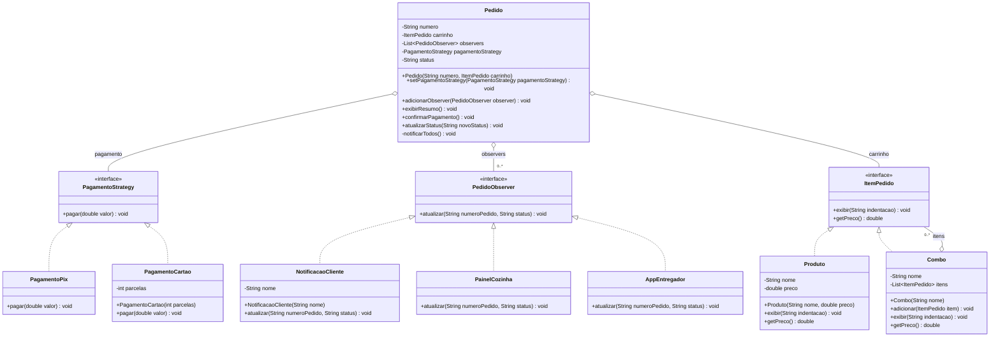

# MVP - Delivery com 3 Padroes de Projeto

Este MVP simula um pedido de delivery usando os tres padroes do repositorio:

- **Composite**: `Produto` e `Combo` implementam `ItemPedido`, permitindo montar um carrinho com itens simples e combos aninhados.
- **Strategy**: `Pedido` usa `PagamentoStrategy` para alternar a forma de pagamento entre `PagamentoPix` e `PagamentoCartao`.
- **Observer**: `Pedido` notifica `NotificacaoCliente`, `PainelCozinha` e `AppEntregador` sempre que o status muda.

## UML integrada



## Compatibilidade com os padrões

| Padrao | Classes no MVP |
|--------|----------------|
| Composite | `ItemPedido`, `Produto`, `Combo` |
| Strategy | `PagamentoStrategy`, `PagamentoPix`, `PagamentoCartao`, `Pedido` |
| Observer | `PedidoObserver`, `NotificacaoCliente`, `PainelCozinha`, `AppEntregador`, `Pedido` |

## Como executar

Na pasta `MVP`:

```bash
javac -d out src/mvp/*.java
java -cp out mvp.Main
```

## Fluxo demonstrado

1. O carrinho e montado com produtos e um combo.
2. O pedido calcula o total usando a arvore do Composite.
3. A forma de pagamento e escolhida via Strategy.
4. Cada mudanca de status dispara notificacoes via Observer.
