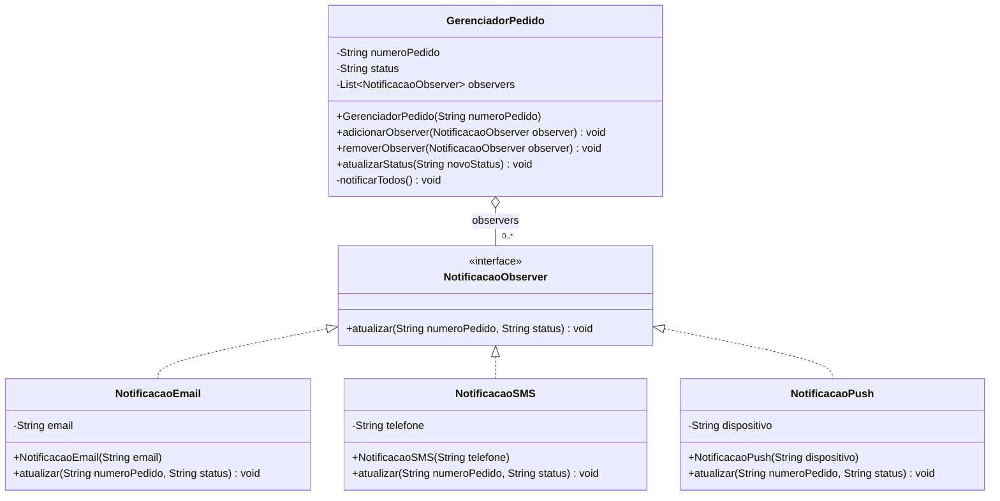

# Observer Pattern - UML

## Diagrama de classes

## Compatibilidade com o padrão

| Elemento | Papel |
|----------|-------|
| `NotificacaoObserver` | Observer |
| `NotificacaoEmail` | ConcreteObserver |
| `NotificacaoSMS` | ConcreteObserver |
| `NotificacaoPush` | ConcreteObserver |
| `GerenciadorPedido` | Subject / Publisher |

## Por que é um pattern?

- `GerenciadorPedido` mantem uma lista de observers pela interface `NotificacaoObserver`.
- Os canais concretos se registram e podem ser removidos em tempo de execução.
- O subject nao precisa saber se esta notificando email, SMS, push ou outro canal futuro.
- O diagrama é compatível com o código em `Observer/Pattern`.
