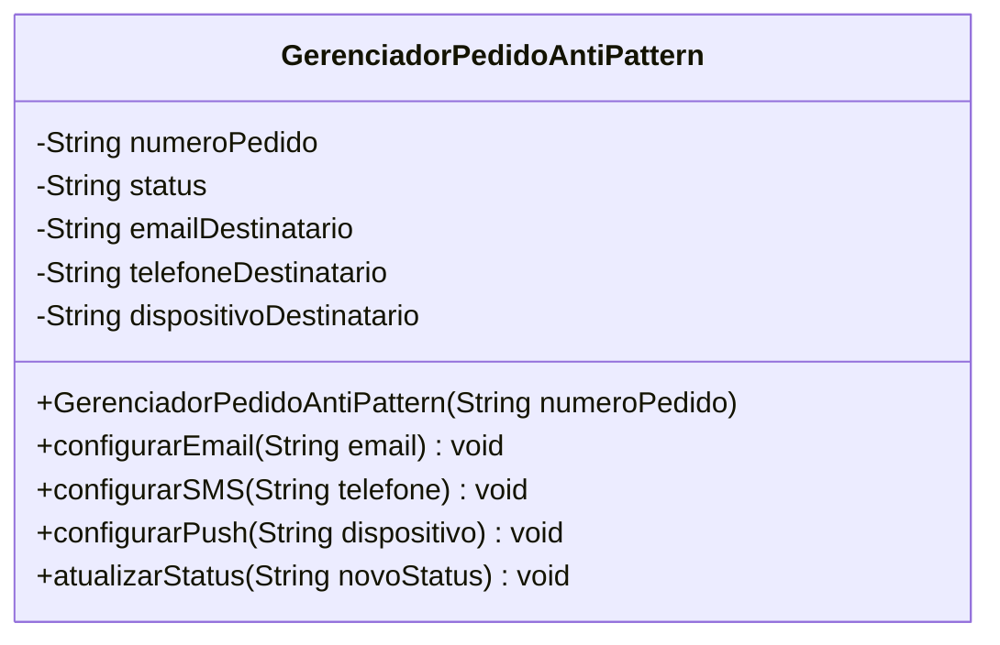

# Observer AntiPattern - UML

## Diagrama de classes

## Compatibilidade com o anti-pattern

| Elemento | Papel |
|----------|-------|
| `GerenciadorPedidoAntiPattern` | Classe que gerencia pedido e notificacoes diretamente |
| `emailDestinatario` | Configuracao hardcoded de email |
| `telefoneDestinatario` | Configuracao hardcoded de SMS |
| `dispositivoDestinatario` | Configuracao hardcoded de push |
| `atualizarStatus()` | Atualiza status e contem a logica de envio dos canais |

## Problemas

- O subject conhece todos os canais concretos.
- Novo canal exige alterar `GerenciadorPedidoAntiPattern`.
- Nao existe lista de observers nem registro/remocao em runtime.
- A classe mistura gerenciamento de pedido com envio de notificacoes.
- O diagrama é compatível com o código em `Observer/anti_pattern`.

## Como corrigir?

Aplicar o **Observer Pattern**: criar `NotificacaoObserver` e fazer o gerenciador manter uma lista de observers.
