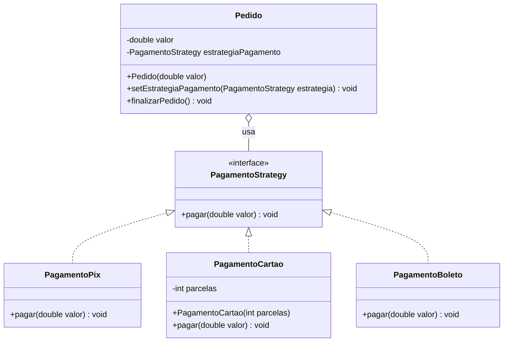

# Strategy Pattern - UML

## Diagrama de classes

## Compatibilidade com o padrão

| Elemento | Papel |
|----------|-------|
| `PagamentoStrategy` | Strategy |
| `PagamentoPix` | ConcreteStrategy |
| `PagamentoCartao` | ConcreteStrategy |
| `PagamentoBoleto` | ConcreteStrategy |
| `Pedido` | Context |

## Por que é um pattern?

- `Pedido` depende da interface `PagamentoStrategy`, não das classes concretas.
- A forma de pagamento pode ser trocada em tempo de execução.
- Novas formas de pagamento podem ser adicionadas criando novas classes, sem alterar `Pedido`.
- O diagrama é compatível com o código em `Strategy/pattern`.
