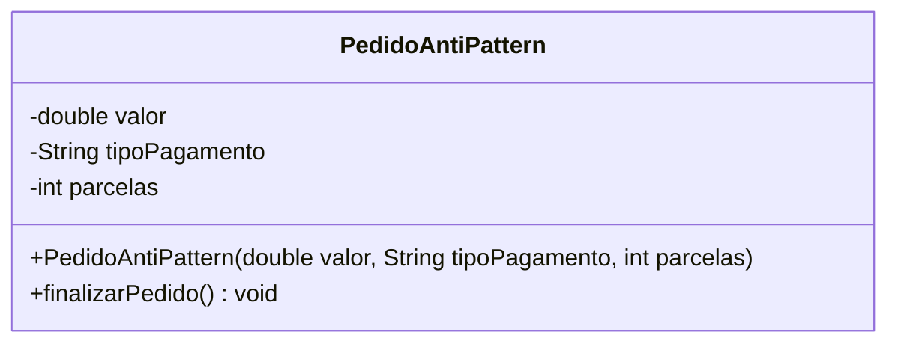

# Strategy AntiPattern - UML

## Diagrama de classes

## Compatibilidade com o anti-pattern

| Elemento | Papel |
|----------|-------|
| `PedidoAntiPattern` | Classe unica que concentra todas as regras de pagamento |
| `tipoPagamento` | Valor textual usado para decidir o comportamento |
| `finalizarPedido()` | Metodo com condicionais para PIX, cartao e boleto |

## Problemas

- Viola OCP: adicionar uma nova forma de pagamento exige editar `finalizarPedido()`.
- Usa `String` como tipo de pagamento, entao erros de digitacao so aparecem em runtime.
- Nao existe polimorfismo nem interface comum para pagamentos.
- O cliente fica acoplado aos nomes esperados: `pix`, `cartao` e `boleto`.

## Como corrigir?

Aplicar o **Strategy Pattern**: criar a interface `PagamentoStrategy` e mover cada regra de pagamento para uma classe concreta.
